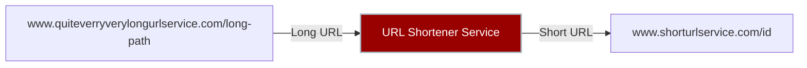

# golang-url-shortner
Simple url shortner made by go, just like tinyUrl or bitly

## What it does
This allows users to input a long URL and they get a shortened version of it

## Key project features:
- Generates a unique short url id for every long url id
- Stores the mappings of the shorturls -> longurls
- Ridirects users from the short url to the original long url

## Testing:
curl -X  POST -d "url=https://www.google.com" http://localhost:8080/shorten